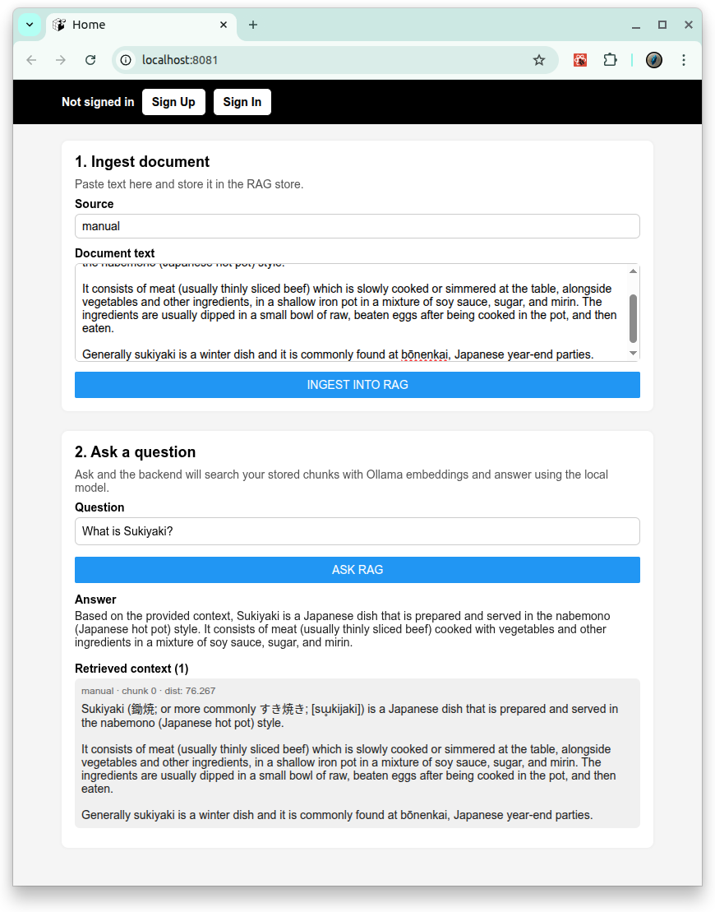
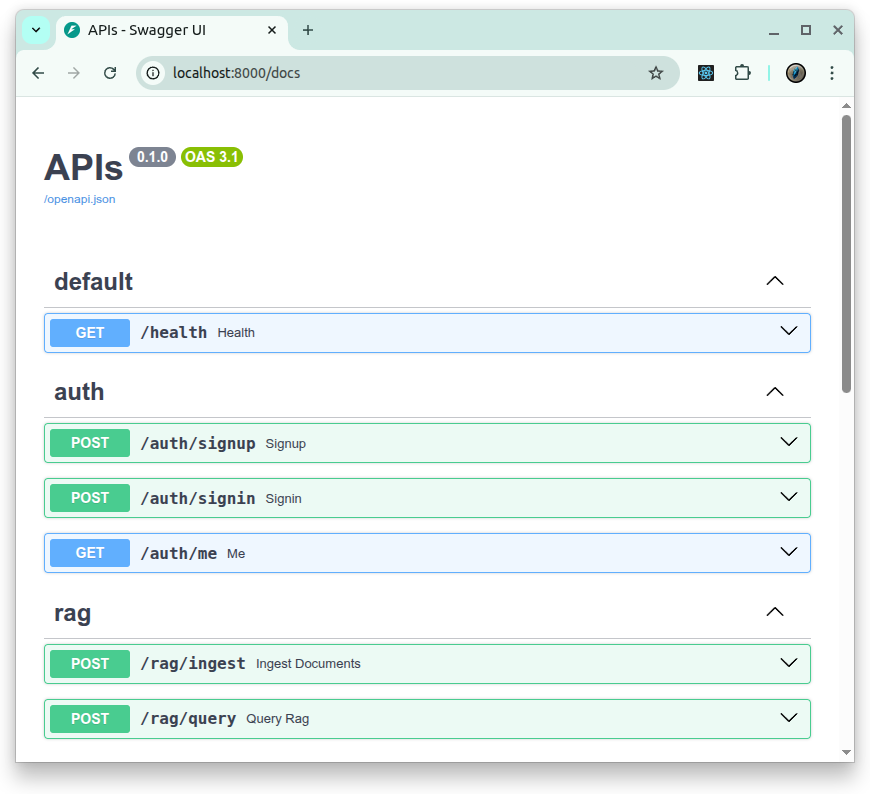

# [RAG Container Template](https://github.com/europanite/rag_container_template "RAG Container Template")

[](https://github.com/europanite/rag_container_template/actions/workflows/ci.yml)
[](https://github.com/europanite/rag_container_template/actions/workflows/lint.yml)
[](https://github.com/europanite/rag_container_template/actions/workflows/codeql.yml)
[](https://github.com/europanite/rag_container_template/actions/workflows/pages/pages-build-deployment)



This repository is a full-stack sandbox for building a **local Retrieval-Augmented Generation (RAG)** system.  
The backend is a FastAPI service with authentication and a RAG API, using **ChromaDB** as a persistent vector store and **Ollama** for both embeddings and chat. The frontend is an Expo / React Native app that talks to the backend.

---

## Features

- **Backend**
  - FastAPI

- **Frontend**
  - Expo / React-Native

- **DataBase**
  - PostgreSQL

- **RAG (Retrieval-Augmented Generation)**
  - **Embeddings** with Ollama
  - **Vector store** with ChromaDB
  - **Chat / Answer generation** 

- **DevOps**
  - **Docker Compose**
  - GitHub Actions workflows

---

## Architecture

```text
+-----------------------------+
|        Frontend (Expo)      |
|  - React Native app         |
|  - Calls backend /auth,     |
|    /items, /rag endpoints   |
+--------------+--------------+
               |
               v
+-----------------------------+
|       Backend (FastAPI)     |
|  - Auth & Items routers     |
|  - RAG router (/rag/...)    |
|  - SQLAlchemy + Postgres    |
+--------------+--------------+
               |
       +-------+----------+
       |                  |
       v                  v
+-------------+   +------------------+
|  ChromaDB   |   |   Ollama (LLM)   |
|  Vector DB  |   |  /api/chat       |
|  /chroma_db |   |  /api/embeddings |
+-------------+   +------------------+
```

---

## 🚀 Getting Started

### 1. Prerequisites
- [Docker Compose](https://docs.docker.com/compose/)
- [Expo Go](https://expo.dev/go)

### 2. Build and start all services:

```bash
# set environment variables:
export REACT_NATIVE_PACKAGER_HOSTNAME=${YOUR_HOST}

# Build the image
docker compose build

# Run the container
docker compose up
```
---

### 3. Test:

```bash
# Backend pytest
docker compose \
  -f docker-compose.test.yml run \
  --rm \
  --entrypoint /bin/sh backend_test \
  -lc 'pytest -q'

# Backend Lint
docker compose \
  -f docker-compose.test.yml run \
  --rm \
  --entrypoint /bin/sh backend_test \
  -lc 'ruff check /app /tests'

# Frontend Test
docker compose \
  -f docker-compose.test.yml run \
  --rm frontend_test
```

## Visit the services:

- Backend API: http://localhost:8000/docs


- Frontend UI (WEB): http://localhost:8081
- Frontend UI (mobile): exp://${YOUR_HOST}:8081: access it with the QR provided by Expo.


---

## RAG API

### Ingest documents

#### POST /rag/ingest

```bash
curl -X POST http://localhost:8000/rag/ingest \
  -H "Content-Type: application/json" \
  -d '{
    "documents": [
      {
        "id": "miura_intro_001",
        "text": "Miura Peninsula is located in Kanagawa, south of Yokohama. It is famous for its coastline, fresh seafood, and views of Mount Fuji on clear days.",
        "source": "local-notes"
      }
    ]
  }'
```

#### Response:
```bash
{
  "total_chunks": 1
}
```

### Ask a question

#### POST /rag/query

```bash
curl -X POST http://localhost:8000/rag/query \
  -H "Content-Type: application/json" \
  -d '{
    "question": "Where is the Miura Peninsula and what is it famous for?",
    "top_k": 5
  }'
```

#### Example response:

```bash
{
  "answer": "The Miura Peninsula is in Kanagawa, south of Yokohama. It is known for its coastline, fresh seafood, and views of Mount Fuji on clear days.",
  "chunks": [
    {
      "id": "miura_intro_001_0",
      "text": "...",
      "source": "local-notes",
      "chunk_index": 0,
      "distance": 0.01
    }
  ]
}
```

---

# License
- Apache License 2.0